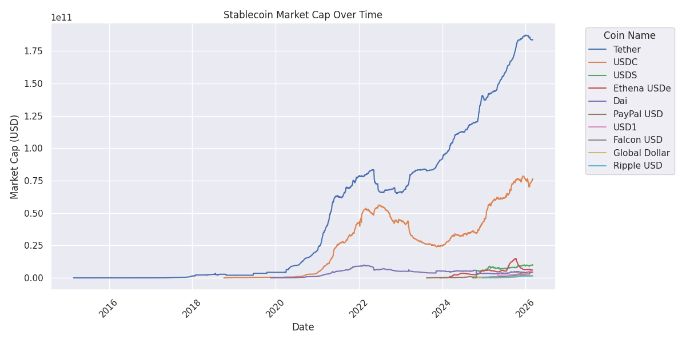
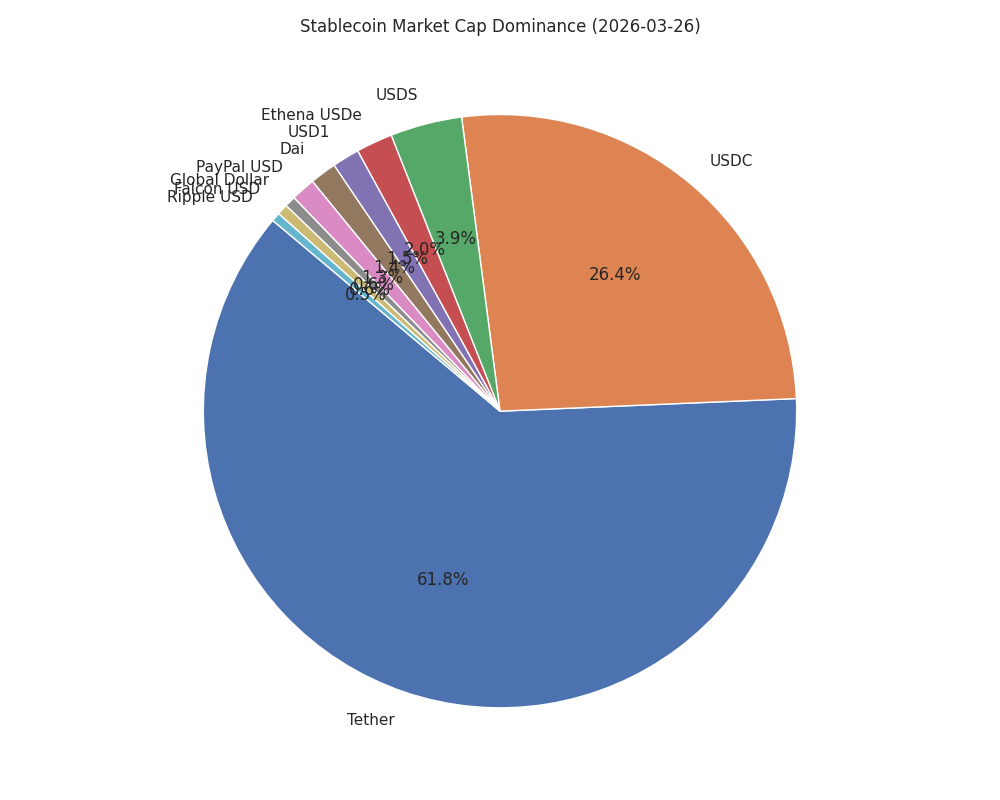

# Stablecoin Tracker

<!-- START_dashboard -->

### 📊 Market Overview
*Last Updated: 2026-02-24 01:20:30 (UTC)*

| Total Market Cap | 24h Change | 7d Change |
| :--- | :--- | :--- |
| **$292,253,771,511** | 🔴 -0.01% | 🟢 +0.17% |

### 📈 Charts
| Market Cap History | Market Dominance |
| :---: | :---: |
|  |  |

### 📰 Latest News
- [SEC Guidance Eases Capital Rules, Pushing Stablecoins Closer to Cash Status - PYMNTS.com](https://news.google.com/rss/articles/CBMiugFBVV95cUxPTU1wS2U3TkxFU3RKS3lmby1CWWZTaGVKcE5XNVpHdU5Dd0hMUXlkRmdwNDBGSXJJbHJWRU11cWF6ekVUUEhHcWFZbi1FcjBPc09mTF9YVHZsLV9uS2VnXzJrUDQtMlc4cUxSWUpFS200c3dJYnBtdWNHZG9xWS1rTE56el9qRFI5VDdDT2Jkc3A3WjNzNzdFeEpLWmhNa2d5LXZKRUtpbGg5bjRCZVJVLXEtdkVIdV9RWFE?oc=5) (Tue, 24 Feb 2026 00:35:47 GMT)
- [NCUA Proposes Licensing Framework for Credit Union Stablecoin Subsidiaries - JD Supra](https://news.google.com/rss/articles/CBMihwFBVV95cUxNYmVxR1JrNE5WNzJlOFcwVzJvZnpiTl9oMEdxa2Q0ZGQyclo4dVJWaVRJcm5NS0ZBR3E4bVdOdzgzN3g4QW9WYUppcno3Y1E4ZGplVU5nLXQxNjNOSnVYVGZTb0FqemhJMi0zRmpDTG5aNWxMRUN5ZmpEOHF5cF9qREt4Z1hDemM?oc=5) (Mon, 23 Feb 2026 23:24:46 GMT)
- [White House Takes The Wheel On The Stablecoin Bill As Yield Debate Narrows - Yahoo Finance](https://news.google.com/rss/articles/CBMihwFBVV95cUxPSlNmMVN2RG01LVdEcnpfQVhod2U1TG8zTjhqUmlqR2J2VDMzenpSSVh2UjRBcjJ6WXh2VnF4VW9TMS1YNGhTNnh3LWhnWHQydGpVa1dUX3J2dGluME9DQXdpMjdyN1M0SDV4cEJFcWJBUlk3N1pLRW5odHliSkFuM2pKc093ME0?oc=5) (Mon, 23 Feb 2026 23:00:58 GMT)
- [World Liberty’s stablecoin attacked, Trump-backed crypto group says - Financial Times](https://news.google.com/rss/articles/CBMicEFVX3lxTE5hT0lONVdCaXdOd0dWUkF3WTUwRzM0MExaNlhPNFlJNkxDNmROa1hzUTU2aEFKd1ZkTmhoXzZ2SWVObmtaSzd6NjZ5VVhWLUdIclp2R05VX3prajhnYXN0eDkxZ2x2MV9kQ21uQ3dmSGg?oc=5) (Mon, 23 Feb 2026 22:37:20 GMT)
- [Trump-Linked Stablecoin Briefly Dipped Below $1 - The Information](https://news.google.com/rss/articles/CBMiiAFBVV95cUxOUjVzTFhlODVZcktOWnJTM0V6TmRRNmpHaFU5Z2oydW84TmZpSVIzU3Y1UlYzN3NVbDVIZExvaDNWeFhVQUZmUGxJSUFCcFRoY1pFTlFDN2c5cVA1MWY2SWpzaGEwWUtfSDM5ay1uVmQzblBXWl9hU0JPY2UyNVdkZDFNbWp6QkNR?oc=5) (Mon, 23 Feb 2026 22:36:34 GMT)

<!-- END_dashboard -->

주요 스테이블코인의 시가총액(Market Cap) 변화를 추적하고 시각화하는 프로젝트입니다.
매일 자동으로 CoinGecko 데이터를 수집하여 시장 흐름을 한눈에 파악할 수 있습니다.

## 📂 프로젝트 구조

- **`data/`**: 수집된 데이터(`csv`)와 시각화 결과물(`png`)이 저장되는 폴더입니다.
- **`src/`**: 데이터 수집 및 시각화 스크립트가 위치합니다.
    - `fetch_daily_data.py`: 현재 시점의 상위 10개 스테이블코인 시가총액을 가져와 CSV에 추가합니다.
    - `generate_plot.py`: 누적된 데이터를 바탕으로 그래프(선 그래프 및 파이 차트)를 생성합니다.
    - `update_readme.py`: 최신 데이터를 바탕으로 `README.md`의 대시보드 섹션을 업데이트합니다.
    - `get_coingekodata.py`: 특정 코인들의 전체 과거 데이터를 한 번에 수집할 때 사용합니다.

## 🚀 시작하기

이 프로젝트는 Python 패키지 매니저인 [uv](https://github.com/astral-sh/uv)를 사용하여 의존성을 관리합니다.

### 설치

```bash
# 의존성 설치
uv sync
```

### 사용 방법

**1. 일일 데이터 수집 (Daily Update)**

현재 시장 데이터를 가져와 `data/stablecoin_marketcap.csv` 파일에 추가합니다.

```bash
uv run src/fetch_daily_data.py
```

**2. 그래프 생성**

수집된 데이터를 기반으로 시각화 이미지를 업데이트합니다. (선 그래프 및 시장 점유율 파이 차트 생성)

```bash
uv run src/generate_plot.py
```

**3. README 대시보드 업데이트**

최신 데이터를 기반으로 `README.md` 파일을 업데이트합니다.

```bash
uv run src/update_readme.py
```

**4. 전체 히스토리 수집 (초기화용)**

지정된 코인들의 과거 모든 데이터를 가져옵니다. (기존 데이터를 덮어쓸 수 있으니 주의하세요)

```bash
uv run src/get_coingekodata.py --output data/stablecoin_marketcap.csv
```

## 🤖 자동화 (GitHub Actions)

이 리포지토리는 GitHub Actions를 통해 **매일 00:00 (UTC)** 에 자동으로 데이터를 수집하고 그래프를 업데이트합니다.
(`.github/workflows/daily_scrape.yml` 참조)

## 💡 참고 사항

- **Cloudscraper 적용**: 일반적인 요청과 달리 실제 브라우저처럼 위장하여 Cloudflare 봇 감지를 우회합니다.
- **안전한 수집**: CoinGecko의 IP 차단을 방지하기 위해 요청 간에 적절한 대기 시간(`time.sleep`)을 둡니다.
- **데이터 인코딩**: CSV 파일은 엑셀 호환성을 위해 `utf-8-sig` 인코딩(또는 호환 형식)을 사용합니다.
