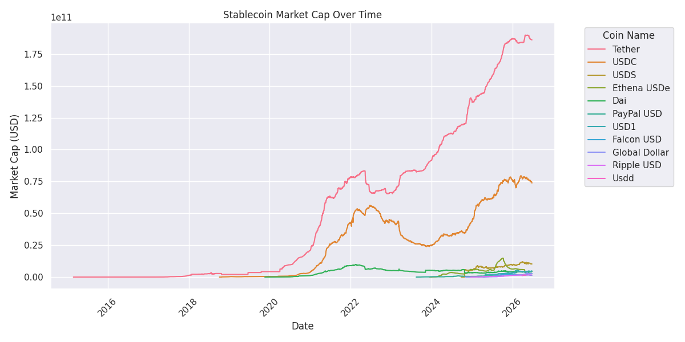
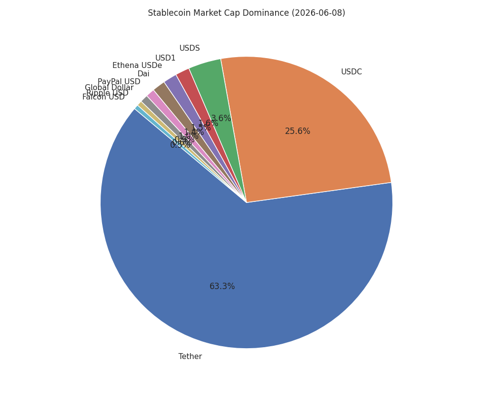

# Stablecoin Tracker

<!-- START_dashboard -->

### 📊 Market Overview
*Last Updated: 2026-04-21 01:51:48 (UTC)*

| Total Market Cap | 24h Change | 7d Change |
| :--- | :--- | :--- |
| **$300,147,038,541** | 🔴 -49.95% | 🟢 +0.52% |

### 📈 Charts
| Market Cap History | Market Dominance |
| :---: | :---: |
|  |  |

### 📰 Latest News
- [The Banks Would Like To Dye Your Stablecoins Pink - Forbes](https://news.google.com/rss/articles/CBMirAFBVV95cUxNMjhpZTZTTnhObTA2MHdOb2tTZzBxR1ZDZ2NiWlRjaGFWb2lGcFl0Zm1HMG9NQl9rMUFsdzNlaEtob1M4cHo4eXNBT2ZUcTF2Sk05QlVteEk4Y2piOWN0MFVTSnl3aW9ZX0xhSDZ1NGtDbjRVTUJQeUhsQ09taHloaFc1a0FoekFtOUJDdmxiX3ViU3VQdkZqUFZsZV9wNVZiTzdYRUtONlp3MFZB?oc=5) (Mon, 20 Apr 2026 23:35:03 GMT)
- [Treasury Announces Proposed Rule to Implement the GENIUS Act’s Requirements to Counter Illicit Finance - WilmerHale](https://news.google.com/rss/articles/CBMi9gFBVV95cUxNaE0wOWtZQ1p5M1lOb0wxcXFnN2RWNDc2YVVNTDNXQ1Jlc0djOE1PRmFxUi1OdnE1UFBVUzkzaTR2RHppNU81SEswdHZuOG5Yd2hjVU5jYkQ4ajVEOEtMOWM0ZjYwbzJUNm5LSk16REVJTnpZQ1dGUUFoMWFOTmcyWDdoalQxRmhfZ3BPQzBXaVZ6UEtWdV8yNU5YdzR5b01BSEg4ZGZmeG1oc1VUblZGUVV6WnBRS3RSWl85LU9lMUVVOXlMSGFlenh0NlA5ME1oQWh3eDRoRUpuaHZHV1l5a1lWaUNBMTFPby02cHZVdnZST0xQZ1E?oc=5) (Mon, 20 Apr 2026 19:54:07 GMT)
- [White House report asserts stablecoin yield ban would have minimal impact on bank lending - JD Supra](https://news.google.com/rss/articles/CBMihwFBVV95cUxNSkloMldUWi1iOC1FYlhHNXduMHRvRy1nWUh5c1ZLYm5HYjJOUWltRmkwUUducGxDVHkwQkhKMnRZSFZJby11QXV2MFZuR0JwcW0waXpNb0lvSjBHSkphYmluclFVMENLb1prVzl5VnpiaHNlaHA4bkdva0E0bEh3b1YxRnJFOTA?oc=5) (Mon, 20 Apr 2026 17:37:31 GMT)
- [Positioning Delaware as a Digital Asset Hub: A Look at Senate Bills 16 and 19 - Consumer Financial Services Law Monitor](https://news.google.com/rss/articles/CBMi0wFBVV95cUxOZFUxYnpuclBBdXNqVDNIaEF4ckxaSmZnRExsMkhyeEVtcFk0WUFCbElSYmNHaGhvc0RPQTBiMFEyd1R1OFN5dmhmMGhMNUNXSFh2OGhlakVRS1ItQk9MTnJ6NW1FQXpwamo3b0YwUkx0MEVSZU1ib1dhOXBGVmpQOFdlb0Y0MTJVLVJDVHJKSDBBNjhDWExfZWlwNTBxRVJVMDlOZWRhcVZKSXpndFhzQUxMcVlmcWRZNTVXU0swLUZmYTNvZGU3aUhrTkJsUVg4MExj?oc=5) (Mon, 20 Apr 2026 17:15:27 GMT)
- [Stablecoins and the Future of FX: A New Era of Liquidity - Thunes](https://news.google.com/rss/articles/CBMimwFBVV95cUxPXzlxWFhzZ3dMcVVmTzFrT0ktOVRIVXMxd2dYSkZkREFsMGhIRklCQm1wNE0xdVpWSThmdDdRNTZ4VXpvcENZcjYyYXF2UDRnZ2ZHMDI4U2laZ2E0NVhJUjkxSnBiRTlvWmpNamJPNWtJNlQ3LVFNbFpkRm5tMTIxUmgtNzhlZlJZZXpNT1c3clNSblM3a2pMLTVjdw?oc=5) (Mon, 20 Apr 2026 17:07:41 GMT)

<!-- END_dashboard -->

주요 스테이블코인의 시가총액(Market Cap) 변화를 추적하고 시각화하는 프로젝트입니다.
매일 자동으로 CoinGecko 데이터를 수집하여 시장 흐름을 한눈에 파악할 수 있습니다.

## 📂 프로젝트 구조

- **`data/`**: 수집된 데이터(`csv`)와 시각화 결과물(`png`)이 저장되는 폴더입니다.
- **`src/`**: 데이터 수집 및 시각화 스크립트가 위치합니다.
    - `fetch_daily_data.py`: 현재 시점의 상위 10개 스테이블코인 시가총액을 가져와 CSV에 추가합니다.
    - `generate_plot.py`: 누적된 데이터를 바탕으로 그래프(선 그래프 및 파이 차트)를 생성합니다.
    - `update_readme.py`: 최신 데이터를 바탕으로 `README.md`의 대시보드 섹션을 업데이트합니다.
    - `get_coingekodata.py`: 특정 코인들의 전체 과거 데이터를 한 번에 수집할 때 사용합니다.

## 🚀 시작하기

이 프로젝트는 Python 패키지 매니저인 [uv](https://github.com/astral-sh/uv)를 사용하여 의존성을 관리합니다.

### 설치

```bash
# 의존성 설치
uv sync
```

### 사용 방법

**1. 일일 데이터 수집 (Daily Update)**

현재 시장 데이터를 가져와 `data/stablecoin_marketcap.csv` 파일에 추가합니다.

```bash
uv run src/fetch_daily_data.py
```

**2. 그래프 생성**

수집된 데이터를 기반으로 시각화 이미지를 업데이트합니다. (선 그래프 및 시장 점유율 파이 차트 생성)

```bash
uv run src/generate_plot.py
```

**3. README 대시보드 업데이트**

최신 데이터를 기반으로 `README.md` 파일을 업데이트합니다.

```bash
uv run src/update_readme.py
```

**4. 전체 히스토리 수집 (초기화용)**

지정된 코인들의 과거 모든 데이터를 가져옵니다. (기존 데이터를 덮어쓸 수 있으니 주의하세요)

```bash
uv run src/get_coingekodata.py --output data/stablecoin_marketcap.csv
```

## 🤖 자동화 (GitHub Actions)

이 리포지토리는 GitHub Actions를 통해 **매일 00:00 (UTC)** 에 자동으로 데이터를 수집하고 그래프를 업데이트합니다.
(`.github/workflows/daily_scrape.yml` 참조)

## 💡 참고 사항

- **Cloudscraper 적용**: 일반적인 요청과 달리 실제 브라우저처럼 위장하여 Cloudflare 봇 감지를 우회합니다.
- **안전한 수집**: CoinGecko의 IP 차단을 방지하기 위해 요청 간에 적절한 대기 시간(`time.sleep`)을 둡니다.
- **데이터 인코딩**: CSV 파일은 엑셀 호환성을 위해 `utf-8-sig` 인코딩(또는 호환 형식)을 사용합니다.
